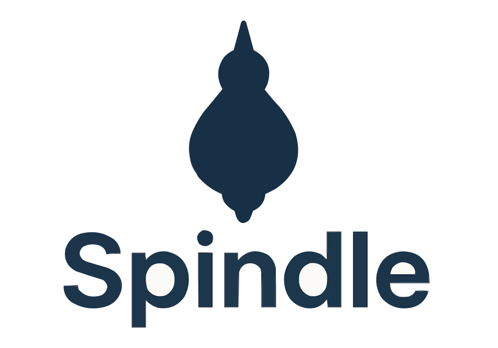

<p align="center">
  
</p>


# Spindle

A tool for real-time extraction of knowledge graphs from multimodal data using BAML and LLMs.

## Overview

Spindle extracts structured knowledge graph triples (subject-predicate-object relationships) from text using Large Language Models. It supports ontology-based extraction with entity consistency across multiple extraction runs.

## MVP Features

The current MVP provides:

- **Automatic ontology recommendation**: Analyze text to automatically suggest appropriate entity and relation types
- **Conservative ontology extension**: Automatically analyze and extend existing ontologies when processing new sources, only adding types when critical information would be lost
- **Ontology-driven extraction**: Define entity and relation types to guide extraction
- **Structured entities with custom attributes**: Extract rich entity metadata including names, types, descriptions, and domain-specific attributes
- **Source metadata tracking**: Each triple includes source name and optional URL
- **Supporting evidence**: Character spans with text and indices computed in post-processing (whitespace-normalized matching)
- **Temporal tracking**: Extraction datetime automatically set for each triple in ISO 8601 format
- **Incremental extraction**: Build knowledge graphs across multiple texts while maintaining entity consistency
- **Multi-source support**: Duplicate triples allowed from different sources for cross-validation
- **Entity consistency**: Recognizes when entities in new text match existing entities
- **Source filtering**: Query triples by their source
- **Date-based filtering**: Query triples by extraction date range
- **Graph database persistence**: Store and query knowledge graphs using embedded Kùzu database with full entity metadata
- **Pattern-based querying**: Flexible graph exploration with wildcard pattern matching
- **BAML-powered**: Uses the BAML framework for type-safe LLM interactions
- **Claude Sonnet 4**: Leverages Anthropic's Claude for high-quality extraction

## Installation

### Prerequisites

- Python 3.8 or higher (3.11 recommended)
- [uv](https://github.com/astral-sh/uv) (recommended) or pip
- Anthropic API key

### Setup

1. Clone the repository:
```bash
git clone <repository-url>
cd spindle
```

2. Install uv (recommended for fast, reliable package management):
```bash
# macOS/Linux
curl -LsSf https://astral.sh/uv/install.sh | sh

# Or with pip
pip install uv

# Or with Homebrew
brew install uv
```

3. Create virtual environment and install dependencies:
```bash
# With uv (recommended)
uv venv
uv pip install -e ".[dev]"

# Or with traditional pip/venv
python -m venv .venv
source .venv/bin/activate  # On Windows: .venv\Scripts\activate
pip install -e ".[dev]"
```

4. Set up your API key:
```bash
# Create a .env file with your Anthropic API key
echo "ANTHROPIC_API_KEY=your_key_here" > .env
```

> **Note**: This project uses `uv` for fast Python package management. See [docs/UV_SETUP.md](docs/UV_SETUP.md) for detailed uv usage and troubleshooting.

## Usage

### Automatic Ontology Recommendation (New!)

#### Option 1: Automatic Recommendation in SpindleExtractor (Simplest!)

The easiest way - just create a `SpindleExtractor` without an ontology and it will automatically recommend one based on your text:

```python
from spindle import SpindleExtractor

# Create extractor WITHOUT an ontology
extractor = SpindleExtractor()

# Extract - ontology will be automatically recommended from the text
text = """
Dr. Sarah Chen led a clinical trial at Massachusetts General Hospital 
to evaluate Medication A for treating chronic migraines...
"""

result = extractor.extract(
    text=text,
    source_name="Research Paper",
    ontology_scope="balanced"  # "minimal", "balanced" (default), or "comprehensive"
)

# The ontology is now available and will be reused for future extractions
print(extractor.ontology.entity_types)  # Auto-recommended entity types
```

**Scope Levels:**
- `"minimal"`: Essential concepts only (3-8 entity types, 4-10 relations) - for quick exploration
- `"balanced"`: Standard analysis (6-12 entity types, 8-15 relations) - recommended default
- `"comprehensive"`: Detailed ontology (10-20 entity types, 12-25 relations) - for research/expertise

#### Option 2: Explicit Recommendation with OntologyRecommender

For more control, use the `OntologyRecommender` directly:

```python
from spindle import OntologyRecommender, SpindleExtractor

# Create recommender
recommender = OntologyRecommender()

# Analyze text and get ontology recommendation
text = """
Dr. Sarah Chen led a clinical trial at Massachusetts General Hospital 
to evaluate Medication A for treating chronic migraines...
"""

recommendation = recommender.recommend(text, scope="balanced")

# View the analysis
print(f"Text Purpose: {recommendation.text_purpose}")
print(f"Entity Types: {[et.name for et in recommendation.ontology.entity_types]}")
print(f"Relation Types: {[rt.name for rt in recommendation.ontology.relation_types]}")

# Use the recommended ontology for extraction
extractor = SpindleExtractor(recommendation.ontology)
result = extractor.extract(text, source_name="Research Paper")
```

### One-Step Recommendation + Extraction

For maximum convenience, recommend and extract in one call:

```python
from spindle import OntologyRecommender

recommender = OntologyRecommender()
recommendation, extraction = recommender.recommend_and_extract(
    text=your_text,
    source_name="Document Name",
    scope="balanced"  # Or "minimal" / "comprehensive"
)

print(f"Auto-detected purpose: {recommendation.text_purpose}")
print(f"Extracted {len(extraction.triples)} triples")
```

### Conservative Ontology Extension (New!)

When processing multiple sources, conservatively extend your ontology only when necessary:

```python
from spindle import OntologyRecommender, SpindleExtractor, create_ontology

# Start with an existing ontology (e.g., for business domain)
ontology = create_ontology(business_entities, business_relations)

# Process first document
extractor = SpindleExtractor(ontology)
result1 = extractor.extract(business_text, "Business News")

# New document from different domain - analyze if extension needed
recommender = OntologyRecommender()
new_text = "Dr. Chen prescribed Medication A for treating hypertension..."

extension, extended_ontology = recommender.analyze_and_extend(
    text=new_text,
    current_ontology=ontology,
    scope="balanced",
    auto_apply=True  # Automatically apply if needed
)

if extended_ontology:
    print(f"Extension needed: {extension.critical_information_at_risk}")
    print(f"Added types: {[et.name for et in extension.new_entity_types]}")
    # Use extended ontology for extraction
    extractor = SpindleExtractor(extended_ontology)
else:
    print("No extension needed - using original ontology")
    # Continue with original ontology

result2 = extractor.extract(new_text, "Medical Research")
```

**Key Principles:**
- Extensions are **conservative** - only when critical information would be lost
- Existing types are preferred over creating new ones
- Extensions are backward-compatible additions
- Original ontology is never modified - new ontology is created

### Basic Example with Manual Ontology

```python
from spindle import SpindleExtractor, create_ontology

# Define your ontology with optional custom attributes
entity_types = [
    {
        "name": "Person", 
        "description": "A human being",
        "attributes": [
            {"name": "title", "type": "string", "description": "Job title"},
            {"name": "start_date", "type": "date", "description": "Employment start date"}
        ]
    },
    {
        "name": "Organization", 
        "description": "A company or institution",
        "attributes": [
            {"name": "founded_year", "type": "int", "description": "Year founded"},
            {"name": "industry", "type": "string", "description": "Industry sector"}
        ]
    }
]

relation_types = [
    {
        "name": "works_at",
        "description": "Employment relationship",
        "domain": "Person",
        "range": "Organization"
    }
]

ontology = create_ontology(entity_types, relation_types)

# Create extractor
extractor = SpindleExtractor(ontology)

# Extract triples with source metadata
text = "Alice Johnson works at TechCorp as a Senior Engineer."
result = extractor.extract(
    text=text,
    source_name="Company Directory 2024",
    source_url="https://example.com/directory"
)

# Access triples with full entity metadata
for triple in result.triples:
    print(f"{triple.subject.name} ({triple.subject.type}) -> {triple.predicate} -> {triple.object.name} ({triple.object.type})")
    print(f"  Subject Description: {triple.subject.description}")
    print(f"  Object Description: {triple.object.description}")
    if triple.subject.custom_atts:
        print(f"  Subject Attributes: {triple.subject.custom_atts}")
    if triple.object.custom_atts:
        print(f"  Object Attributes: {triple.object.custom_atts}")
    print(f"  Source: {triple.source.source_name}")
    print(f"  Extracted: {triple.extraction_datetime}")
    print(f"  Evidence: {triple.supporting_spans[0].text}")
```

### Incremental Extraction with Multi-Source Support

```python
# First extraction from source 1
result1 = extractor.extract(
    text="Alice works at TechCorp.",
    source_name="Employee Database",
    existing_triples=[]
)

# Second extraction from source 2 with entity consistency
# Duplicate triples are allowed since it's a different source
result2 = extractor.extract(
    text="Alice Johnson works at TechCorp and uses Python.",
    source_name="Company Blog",
    source_url="https://example.com/blog/team",
    existing_triples=result1.triples
)

# Alice will be recognized as the same entity ("Alice Johnson" used consistently)
# If the same fact appears in both sources, both triples are kept for validation

# Filter by source
from spindle import filter_triples_by_source
blog_triples = filter_triples_by_source(result2.triples, "Company Blog")
```

### Running the Examples

Two complete examples are provided:

**Manual Ontology (`example.py`):**
```bash
python example.py
```

This demonstrates:
- Defining a custom ontology
- Extracting triples from multiple texts with source metadata
- Maintaining entity consistency across sources
- Supporting character spans for evidence
- Handling duplicate triples from different sources
- Filtering triples by source
- Serialization of triples with metadata

**Automatic Ontology Recommendation (`example_ontology_recommender.py`):**
```bash
python example_ontology_recommender.py
```

This demonstrates:
- Automatic ontology recommendation from text analysis
- Text purpose/goal inference
- Domain-appropriate entity and relation type generation
- Using recommended ontologies for extraction
- One-step recommendation + extraction workflow
- JSON serialization of recommendations

**Auto-Ontology in SpindleExtractor (`example_auto_ontology.py`):**
```bash
python example_auto_ontology.py
```

This demonstrates:
- SpindleExtractor without providing an ontology
- Automatic ontology recommendation on first extract() call
- Reusing the same ontology for subsequent extractions
- Entity consistency across multiple texts with auto-recommended ontology

**Scope Comparison (`example_scope_comparison.py`):**
```bash
python example_scope_comparison.py
```

This demonstrates:
- Comparing minimal, balanced, and comprehensive scopes
- How the same text produces different ontologies at different granularities
- Guidance on when to use each scope level
- Extraction comparison across scopes

**Conservative Ontology Extension (`example_ontology_extension.py`):**
```bash
python example_ontology_extension.py
```

This demonstrates:
- Starting with an existing ontology
- Analyzing new text to determine if extension is needed
- Conservative extension principles (only when critical information at risk)
- Applying extensions and extracting with evolved ontology
- When extensions are/aren't needed

## Defining Custom Ontologies

An ontology consists of entity types and relation types:

### Entity Types

```python
entity_types = [
    {
        "name": "Person",
        "description": "A human being, identified by their name"
    },
    {
        "name": "Location",
        "description": "A geographic place, city, or address"
    }
]
```

### Relation Types

```python
relation_types = [
    {
        "name": "located_in",
        "description": "Physical location relationship",
        "domain": "Person",      # Subject must be this entity type
        "range": "Location"      # Object must be this entity type
    }
]
```

## Graph Database Persistence

Spindle includes **GraphStore**, a persistent graph database powered by Kùzu for storing and querying knowledge graphs.

### Quick Start

```python
from spindle import SpindleExtractor, create_ontology, GraphStore

# Extract triples
ontology = create_ontology(entity_types, relation_types)
extractor = SpindleExtractor(ontology)
result = extractor.extract(text, source_name="My Source")

# Store in graph database
with GraphStore() as store:
    # Add triples
    store.add_triples(result.triples)
    
    # Query by pattern
    employees = store.query_by_pattern(predicate="works_at")
    
    # Filter by source
    my_source_data = store.query_by_source("My Source")
    
    # Get statistics
    stats = store.get_statistics()
    print(f"Stored {stats['edge_count']} relationships")
```

### Key Features

- **Embedded Database**: No separate server needed - Kùzu runs in-process
- **Full CRUD Operations**: Create, read, update, delete nodes and edges
- **Node Embeddings**: Node2Vec-based structure-aware embeddings for similarity search
- **Pattern Matching**: Query with wildcards for flexible exploration
- **Source Tracking**: Filter triples by source document
- **Temporal Queries**: Filter by extraction date ranges
- **Cypher Support**: Execute direct Cypher queries for advanced use cases
- **Triple Fidelity**: Full roundtrip support (Triple → Store → Triple)

### Configuration

GraphStore automatically organizes all graphs in a `/graphs` directory at the project root:

```python
# Use default graph name - creates /graphs/spindle_graph/
store = GraphStore()

# Specify custom graph name - creates /graphs/custom_graph/
store = GraphStore(db_path="custom_graph")

# .db extension is automatically removed
store = GraphStore(db_path="custom_graph.db")  # Still creates /graphs/custom_graph/
```

All graph databases are stored in: `/graphs/<graph_name>/`

### Example: Computing Node Embeddings

```python
from spindle import GraphStore, ChromaVectorStore

with GraphStore() as store:
    # Build your graph
    store.add_triples(result.triples)
    
    # Compute Node2Vec embeddings (structure-aware)
    vector_store = ChromaVectorStore()
    embeddings = store.compute_graph_embeddings(
        vector_store,
        dimensions=128
    )
    
    # Nodes now have embeddings that capture structural similarity
    # Find structurally similar nodes using vector store queries
```

### Example: Multi-Source Knowledge Graph

```python
with GraphStore() as store:
    # Add triples from multiple sources
    result1 = extractor.extract(text1, "Wikipedia")
    store.add_triples(result1.triples)
    
    result2 = extractor.extract(text2, "Company Website")
    store.add_triples(result2.triples)
    
    # Query all "works_at" relationships
    employees = store.query_by_pattern(predicate="works_at")
    
    # Find facts confirmed by multiple sources
    all_edges = store.query_by_pattern()
    fact_to_sources = {}
    for edge in all_edges:
        fact = (edge['subject'], edge['predicate'], edge['object'])
        if fact not in fact_to_sources:
            fact_to_sources[fact] = []
        fact_to_sources[fact].append(edge['source'])
    
    # Multi-source facts are more trustworthy
    confirmed = {f: s for f, s in fact_to_sources.items() if len(s) > 1}
```

### Installation

GraphStore requires the Kùzu package:

```bash
pip install kuzu>=0.7.0
```

This is automatically included when you install Spindle dependencies with `pip install -r requirements.txt`.

### Documentation

For comprehensive documentation, see [`docs/GRAPH_STORE.md`](docs/GRAPH_STORE.md), which covers:
- Detailed API reference
- Advanced usage patterns
- Query optimization
- Best practices
- Migration strategies
- Troubleshooting

### Running the Example

```bash
# With uv
uv run python demos/example_graph_store.py

# Or if using activated venv
python demos/example_graph_store.py
```

## Project Structure

```
spindle/
├── spindle/                         # Main package
│   ├── __init__.py                  # Package exports
│   ├── extractor.py                 # Core extraction functionality
│   ├── graph_store.py               # Graph database persistence
│   ├── baml_src/                    # BAML schema definitions
│   │   ├── clients.baml             # LLM client configurations
│   │   ├── generators.baml          # Code generation config
│   │   └── spindle.baml             # Knowledge graph extraction and ontology recommendation
│   └── baml_client/                 # Auto-generated BAML Python client
├── demos/                           # Example scripts
│   ├── example.py                   # Manual ontology usage example
│   ├── example_graph_store.py       # GraphStore demonstration
│   ├── example_ontology_recommender.py  # Explicit ontology recommendation
│   ├── example_auto_ontology.py     # Auto-ontology in SpindleExtractor
│   ├── example_scope_comparison.py  # Comparing scope levels
│   └── example_ontology_extension.py  # Conservative ontology extension
├── tests/                           # Test suite
│   ├── test_extractor.py            # Extractor tests
│   ├── test_graph_store.py          # GraphStore tests
│   ├── test_helpers.py              # Helper function tests
│   ├── test_integration.py          # Integration tests
│   ├── test_recommender.py          # OntologyRecommender tests
│   └── test_serialization.py        # Serialization tests
├── docs/                            # Documentation
│   ├── GRAPH_STORE.md               # GraphStore usage guide
│   ├── TESTING.md                   # Testing documentation
│   └── ...                          # Other docs
├── setup.py                         # Package installation config
├── requirements.txt                 # Python dependencies
└── README.md                        # This file
```

## API Reference

### `OntologyRecommender`

Service for automatically recommending ontologies based on text analysis using principled design guidelines.

**Methods:**
- `recommend(text: str, scope: str = "balanced") -> OntologyRecommendation`: Analyze text and recommend an appropriate ontology. Scope must be one of "minimal", "balanced", or "comprehensive".
- `recommend_and_extract(text: str, source_name: str, source_url: Optional[str] = None, scope: str = "balanced", existing_triples: List[Triple] = None) -> Tuple[OntologyRecommendation, ExtractionResult]`: Recommend ontology and extract triples in one step.
- `analyze_extension(text: str, current_ontology: Ontology, scope: str = "balanced") -> OntologyExtension`: Conservatively analyze if an existing ontology needs extension for new text.
- `extend_ontology(current_ontology: Ontology, extension: OntologyExtension) -> Ontology`: Apply an extension to create an extended ontology.
- `analyze_and_extend(text: str, current_ontology: Ontology, scope: str = "balanced", auto_apply: bool = True) -> Tuple[OntologyExtension, Optional[Ontology]]`: Analyze and optionally apply extensions in one step.

**Scope Levels:**
- `"minimal"`: Essential concepts only (typically 3-8 entity types, 4-10 relation types). Use for quick exploration, simple queries, and broad pattern identification.
- `"balanced"`: Standard analysis (typically 6-12 entity types, 8-15 relation types). Recommended default for general-purpose extraction.
- `"comprehensive"`: Detailed ontology (typically 10-20 entity types, 12-25 relation types). Use for detailed analysis, domain expertise, and research.

Note: These are guidelines, not hard limits. The LLM determines the actual number of types based on principled ontology design.

**Returns (OntologyRecommendation):**
- `ontology`: The recommended Ontology object (ready for use with SpindleExtractor)
- `text_purpose`: Analysis of the text's overarching purpose/goal
- `reasoning`: Explanation of why these entity and relation types were recommended

### `SpindleExtractor`

Main interface for triple extraction with a predefined or auto-recommended ontology.

**Methods:**
- `__init__(ontology: Optional[Ontology] = None, ontology_scope: str = "balanced")`: Initialize with an ontology. If None, an ontology will be automatically recommended from the text when extract() is first called, using the specified scope.
- `extract(text: str, source_name: str, source_url: Optional[str] = None, existing_triples: List[Triple] = None, ontology_scope: Optional[str] = None) -> ExtractionResult`: Extract triples from text with source metadata. If no ontology was provided at init, one will be automatically recommended. The `ontology_scope` parameter can override the default scope for this specific extraction.

### `create_ontology()`

Factory function to create ontology objects.

**Parameters:**
- `entity_types`: List of dicts with 'name' and 'description'
- `relation_types`: List of dicts with 'name', 'description', 'domain', and 'range'

**Returns:** `Ontology` object

### `create_source_metadata()`

Create a SourceMetadata object.

**Parameters:**
- `source_name`: Name or identifier of the source
- `source_url`: Optional URL of the source

**Returns:** `SourceMetadata` object

### `triples_to_dict()`

Convert Triple objects to dictionaries for serialization.

**Parameters:**
- `triples`: List of Triple objects

**Returns:** List of dictionaries with all triple fields including source metadata and supporting spans

### `dict_to_triples()`

Convert dictionaries back to Triple objects.

**Parameters:**
- `dicts`: List of dictionaries with triple fields

**Returns:** List of Triple objects

### `get_supporting_text()`

Extract supporting text snippets from a triple's character spans.

**Parameters:**
- `triple`: A Triple object

**Returns:** List of text strings from the supporting spans

### `filter_triples_by_source()`

Filter triples to only those from a specific source.

**Parameters:**
- `triples`: List of Triple objects
- `source_name`: Name of the source to filter by

**Returns:** List of triples from the specified source

### `parse_extraction_datetime()`

Parse the extraction datetime string into a datetime object.

**Parameters:**
- `triple`: A Triple object

**Returns:** `datetime` object, or None if parsing fails

### `filter_triples_by_date_range()`

Filter triples by extraction date range.

**Parameters:**
- `triples`: List of Triple objects
- `start_date`: Optional start datetime (inclusive)
- `end_date`: Optional end datetime (inclusive)

**Returns:** List of triples extracted within the date range

### `ontology_to_dict()`

Convert an Ontology object to a dictionary for serialization.

**Parameters:**
- `ontology`: An Ontology object

**Returns:** Dictionary with 'entity_types' and 'relation_types' keys

### `recommendation_to_dict()`

Convert an OntologyRecommendation to a dictionary for serialization.

**Parameters:**
- `recommendation`: An OntologyRecommendation object

**Returns:** Dictionary with ontology, text_purpose, and reasoning

### `extension_to_dict()`

Convert an OntologyExtension to a dictionary for serialization.

**Parameters:**
- `extension`: An OntologyExtension object

**Returns:** Dictionary with needs_extension, new_entity_types, new_relation_types, critical_information_at_risk, and reasoning

### `GraphStore`

Persistent graph database for storing and querying knowledge graphs using Kùzu.

**Initialization:**
- `__init__(db_path: str = "spindle_graph")`: Initialize with graph name or path. Defaults to "spindle_graph". All graphs are automatically stored in `/graphs/<name>/` directory.

**Graph Management:**
- `create_graph(db_path: Optional[str] = None)`: Initialize new graph database
- `delete_graph()`: Delete entire database (irreversible)
- `close()`: Close database connection
- Context manager support (`with GraphStore() as store:`)

**Node Operations:**
- `add_node(name: str, entity_type: str, metadata: Dict = None) -> bool`: Add single node
- `add_nodes(nodes: List[Dict]) -> int`: Bulk add nodes
- `get_node(name: str) -> Optional[Dict]`: Retrieve node by name
- `update_node(name: str, updates: Dict) -> bool`: Update node properties
- `delete_node(name: str) -> bool`: Delete node and its edges

**Edge Operations:**
- `add_edge(subject: str, predicate: str, obj: str, metadata: Dict = None) -> Dict[str, Any]`: Add single edge with intelligent evidence merging (returns success/message dict)
- `add_edges(edges: List[Dict]) -> int`: Bulk add edges
- `get_edge(subject: str, predicate: str, obj: str) -> Optional[List[Dict]]`: Get edge with consolidated evidence from all sources
- `update_edge(subject: str, predicate: str, obj: str, updates: Dict) -> bool`: Update edge properties
- `delete_edge(subject: str, predicate: str, obj: str) -> bool`: Delete edge matching pattern

**Triple Integration:**
- `add_triples(triples: List[Triple]) -> int`: Bulk import from Spindle extraction
- `get_triples() -> List[Triple]`: Export all edges as Triple objects
- `add_edge_from_triple(triple: Triple) -> bool`: Create edge from Triple object
- `add_nodes_from_triple(triple: Triple) -> Tuple[bool, bool]`: Extract and add nodes from triple

**Query Operations:**
- `query_by_pattern(subject: Optional[str] = None, predicate: Optional[str] = None, obj: Optional[str] = None) -> List[Dict]`: Pattern matching (None = wildcard)
- `query_by_source(source_name: str) -> List[Dict]`: Filter by source document (searches within nested evidence)
- `query_by_date_range(start: Optional[datetime] = None, end: Optional[datetime] = None) -> List[Dict]`: Filter by extraction date (span-level timestamps)
- `query_cypher(cypher_query: str) -> List[Dict]`: Execute raw Cypher query

**Utility:**
- `get_statistics() -> Dict`: Return graph statistics (node count, edge count, sources, etc.)

See [`docs/GRAPH_STORE.md`](docs/GRAPH_STORE.md) for comprehensive documentation.

## Architecture

Spindle uses the BAML (Basically, A Made-up Language) framework to define type-safe LLM interactions:

1. **BAML Schema** (`spindle/baml_src/spindle.baml`): Defines data structures and the extraction function
2. **Generated Client** (`spindle/baml_client/`): Auto-generated Python client for type-safe LLM calls
3. **Python Wrapper** (`spindle/extractor.py`): High-level interface for easy use

The extraction process:
1. User defines an ontology (entity and relation types)
2. Text is passed to the LLM along with:
   - The ontology defining valid types
   - Source metadata (name and optional URL)
   - Existing triples from other sources for entity consistency
3. LLM extracts triples conforming to the ontology with:
   - Source metadata attached to each triple
   - Text spans providing supporting evidence (exact quotes from source)
   - Entity names consistent with existing triples
4. Post-processing automatically:
   - Computes accurate character indices for each text span
   - Sets extraction datetime (ISO 8601) for all triples
5. Duplicate triples from different sources are preserved for cross-validation

## Future Work

The MVP is a foundation for the full Spindle system. Future enhancements:

- Multimodal support (images, PDFs, audio)
- Web API/microservice interface
- Multiple LLM providers (OpenAI, local models)
- Visualization tools (graph visualization UI)
- Real-time streaming extraction
- Advanced graph analytics and reasoning

## Requirements

- `baml-py==0.211.2`: BAML framework for Python
- `python-dotenv==1.0.0`: Environment variable management
- `kuzu>=0.7.0`: Embedded graph database for GraphStore (optional)

## Testing

Spindle includes a comprehensive test suite with 84+ unit tests and integration tests.

### Running Tests

```bash
# With uv (recommended)
# Run all unit tests (fast, no API calls)
uv run pytest tests/ -m "not integration"

# Run with coverage report
uv run pytest tests/ -m "not integration" --cov=spindle --cov-report=term-missing

# Run integration tests (requires API key)
uv run pytest tests/ -m integration

# Or if using activated venv
pytest tests/ -m "not integration"
```

### Test Coverage

Current test coverage: **91%**

Tests cover:
- Helper functions (character span matching, filtering, datetime parsing)
- Serialization (triples, ontologies, recommendations)
- SpindleExtractor (with mocked LLM calls)
- OntologyRecommender (with mocked LLM calls)
- Integration tests (real LLM calls)

For detailed testing documentation, see [`docs/TESTING.md`](docs/TESTING.md).

## License

[Add license information]

## Contributing

[Add contribution guidelines]

