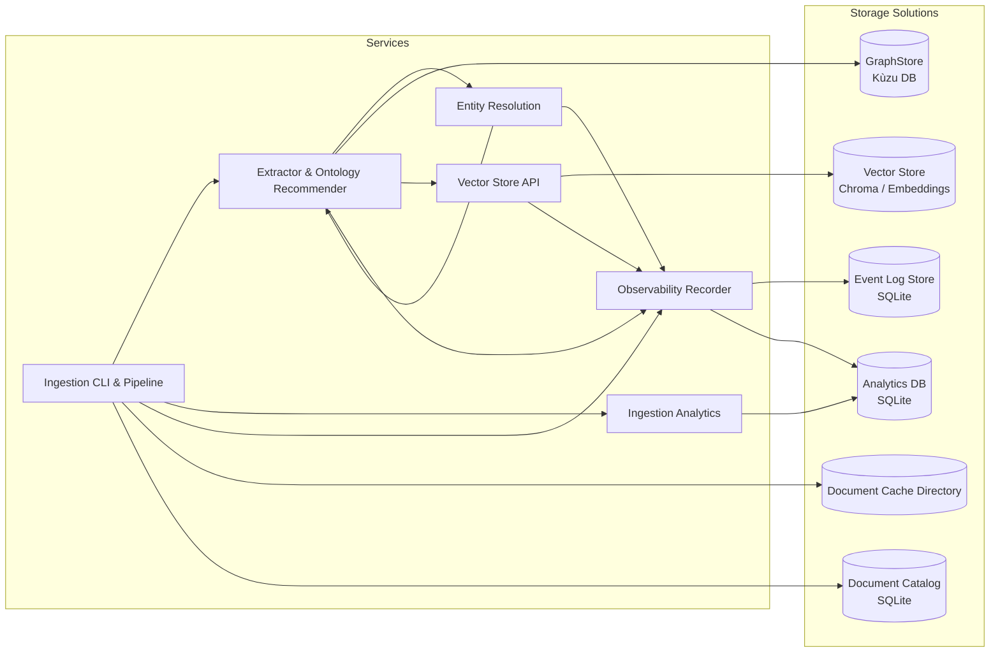

# Package Structure

## Overview

Spindle is organized as a proper Python package for better maintainability and distribution.

## Directory Structure

```
spindle/
├── spindle/                         # Main package
│   ├── __init__.py                  # Public API exports
│   ├── extraction/                  # Extraction package
│   │   ├── __init__.py             # Public API exports
│   │   ├── extractor.py            # SpindleExtractor class
│   │   ├── recommender.py           # OntologyRecommender class
│   │   ├── process.py               # Process extraction functions
│   │   ├── utils.py                # Public utility functions
│   │   └── helpers.py              # Internal helper functions
│   ├── graph_store.py               # Embedded Kùzu persistence layer
│   ├── vector_store/                # Embedding + vector DB integrations
│   │   ├── __init__.py              # Public API exports
│   │   ├── base.py                  # VectorStore abstract base class
│   │   ├── chroma.py                # ChromaVectorStore implementation
│   │   ├── embeddings.py            # Embedding function factories
│   │   └── graph_embeddings.py     # GraphEmbeddingGenerator class
│   ├── observability/               # Service event primitives + persistence helpers
│   ├── baml_src/                    # Authoritative BAML schemas
│   │   ├── clients.baml             # LLM client configurations
│   │   ├── generators.baml          # Code generation settings
│   │   └── spindle.baml             # Extraction + recommendation endpoints
│   ├── baml_client/                 # Auto-generated BAML Python client (do not edit)
│   └── notebooks/                   # Exploratory notebooks (optional tooling)
├── demos/                           # Runnable examples (invoke with uv run)
│   ├── example.py                   # Manual ontology workflow
│   ├── example_auto_ontology.py     # Auto-recommended ontology flow
│   ├── example_scope_comparison.py  # Minimal vs balanced vs comprehensive scopes
│   └── example_ontology_extension.py # Conservative ontology extension demo
├── tests/                           # Pytest suite
│   ├── conftest.py                  # Shared fixtures + marks
│   ├── fixtures/                    # Sample ontologies/text fixtures
│   ├── test_extractor.py            # SpindleExtractor unit tests
│   ├── test_graph_store.py          # GraphStore behaviour
│   ├── test_embeddings.py           # Vector store + embedding helpers
│   ├── test_recommender.py          # OntologyRecommender logic
│   └── test_integration.py          # Real LLM integration tests (requires API keys)
├── docs/                            # Additional documentation
│   ├── QUICKSTART.md
│   ├── UV_SETUP.md
│   └── ...
├── spindle_storage/                 # Default unified storage root (generated by config init)
├── htmlcov/                         # Coverage reports (generated)
├── pyproject.toml                   # Project metadata + dependencies
├── requirements.txt                 # Locked dependency snapshot (optional)
├── requirements-dev.txt             # Dev-only dependencies snapshot
├── setup.py                         # Legacy setuptools entry point
└── README.md                        # Top-level overview
```

> Storage directories are configurable. Run `uv run spindle-ingest config init`
> to generate `config.py` and point Spindle at a custom root. See
> `docs/CONFIGURATION.md` for details.

## Architecture Diagram



## Module Organization

### `spindle/` Package

The main package contains all the core functionality:

#### `spindle/__init__.py`
- Exports all public API functions and classes
- Handles optional imports (e.g., GraphStore requires kuzu)
- Defines `__version__` and `__all__`

Public API:
```python
# Main classes
SpindleExtractor
OntologyRecommender
GraphStore              # Optional (requires kuzu)
VectorStore             # Optional (requires chromadb + embeddings extras)
ChromaVectorStore

# Factory functions
create_ontology
create_source_metadata

# Serialization
triples_to_dict
dict_to_triples
ontology_to_dict
recommendation_to_dict
extension_to_dict

# Query/filter
get_supporting_text
filter_triples_by_source
parse_extraction_datetime
filter_triples_by_date_range

# Embedding helpers
create_openai_embedding_function
create_huggingface_embedding_function
get_default_embedding_function
```

#### `spindle/extraction/` Package
Core extraction functionality organized into modules:
- `extractor.py`: `SpindleExtractor` class for triple extraction
- `recommender.py`: `OntologyRecommender` class for ontology recommendation
- `process.py`: Process graph extraction functions
- `utils.py`: Public utility functions (ontology creation, serialization, filtering)
- `helpers.py`: Internal helper functions (span processing, event recording)
- `__init__.py`: Public API exports maintaining backward compatibility

#### `spindle/graph_store.py`
Graph database persistence (optional, requires kuzu):
- `GraphStore`: Main class for graph database operations
- CRUD operations for nodes and edges
- Query operations (pattern matching, source filtering, date ranges)
- Cypher query support

#### `spindle/vector_store/`
Vector embeddings and similarity search utilities (optional extras):
- `base.py`: `VectorStore` abstract base class for embedding backends
- `chroma.py`: `ChromaVectorStore` implementation for local retrieval
- `embeddings.py`: Embedding function factories (`create_openai_embedding_function`, `create_huggingface_embedding_function`, `create_gemini_embedding_function`, `get_default_embedding_function`)
- `graph_embeddings.py`: `GraphEmbeddingGenerator` class for Node2Vec-based graph embeddings
- `__init__.py`: Public API exports maintaining backward compatibility
- Optional integration with `GraphStore.compute_graph_embeddings`

#### `spindle/observability/`
Service-wide event logging support:
- `events.py`: `ServiceEvent` dataclass, `EventRecorder`, and global recorder helpers
- `storage.py`: `EventLogStore` (SQLite persistence), replay helpers, and observer attachment utilities
- `__init__.py`: Public exports for recorder, observers, and storage helpers

### `spindle/baml_src/` BAML Schemas

BAML (Basically, A Made-up Language) schema definitions:

- `clients.baml`: LLM client configurations (Claude Sonnet 4)
- `generators.baml`: Code generation settings
- `spindle.baml`: Function definitions for extraction and ontology recommendation

### `spindle/baml_client/` Generated Code

Auto-generated Python client from BAML schemas:
- **Do not edit manually** - regenerated from BAML files
- `types.py`: Type definitions (Triple, Ontology, etc.)
- Client functions for calling BAML-defined functions

### `demos/` Example Scripts

Runnable examples demonstrating various features:
- All examples import from `spindle` package
- Run from repo root with uv: `uv run python demos/example.py`
- Additional demos cover auto-ontology, scope comparison, and ontology extension flows

### `tests/` Test Suite

Comprehensive test coverage:
- Unit tests for all major functionality
- Integration tests (require API key)
- Fixtures in `conftest.py`
- Run with: `uv run pytest tests/`

## Installation

### Development Mode

Recommended for active development:

```bash
uv pip install -e ".[dev]"
```

This installs the package in "editable" mode - changes to the code are immediately available.

### With Optional Dependencies

```bash
# Add embeddings backends (local sentence-transformers)
uv pip install -e ".[dev,embeddings]"

# Add remote embedding APIs (OpenAI, Gemini, Hugging Face)
uv pip install -e ".[dev,embeddings-api]"

# Full toolbox (dev + local + remote embeddings)
uv pip install -e ".[dev,embeddings,embeddings-api]"
```

### Direct Requirements

```bash
uv pip install -r requirements.txt
```

## Imports

All public APIs are imported through the `spindle` package:

```python
# Core functionality
from spindle import SpindleExtractor, create_ontology

# Ontology recommendation
from spindle import OntologyRecommender

# Graph database (optional)
from spindle import GraphStore

# Utilities
from spindle import (
    triples_to_dict,
    filter_triples_by_source,
    parse_extraction_datetime
)
```

## Adding New Functionality

### Adding a New Module

1. Create the module in `spindle/` directory
2. Import and export public APIs in `spindle/__init__.py`
3. Update `__all__` list in `__init__.py`
4. Add tests in `tests/`
5. Document in relevant docs

### Adding a New Function

1. Add function to appropriate module (`extraction/` package or `graph_store.py`)
2. Export from `spindle/__init__.py` if public
3. Add to `__all__` list if public
4. Write tests
5. Document in docstring and README

## Package Distribution

The package is configured for distribution via PyPI:

- `setup.py`: Package metadata and configuration
- `MANIFEST.in`: Specifies additional files to include
- Version: Defined in `spindle/__init__.py`

To build distribution:
```bash
uv run python -m build  # install with `uv pip install build` if missing
```

## Best Practices

1. **Import from Package**: Always use `from spindle import ...`
2. **Public API**: Only import from `spindle/__init__.py` exports
3. **Private Functions**: Prefix with `_` (e.g., `_find_span_indices`)
4. **Optional Dependencies**: Handle import errors gracefully (see GraphStore)
5. **Type Hints**: Use type hints from `baml_client.types`
6. **Documentation**: Update docstrings and README for new features

## Maintenance

### Regenerating BAML Client

If you modify BAML schemas:

```bash
# Regenerate Python client
uv run baml-cli generate
```

This updates `spindle/baml_client/` directory.

### Running Tests

```bash
# All tests
uv run pytest tests/

# Specific test file
uv run pytest tests/test_extractor.py -v

# Without integration tests (no API key needed)
uv run pytest tests/ -m "not integration"

# With coverage
uv run pytest tests/ --cov=spindle --cov-report=term-missing
```

### Checking Package Structure

```bash
# Verify imports
uv run python -c "from spindle import *; print('OK')"

# List package contents
uv run python -c "import spindle; print(dir(spindle))"

# Check version
uv run python -c "import spindle; print(spindle.__version__)"
```

## Migration from Old Structure

The old structure had `spindle.py` and `graph_store.py` at the root. These have been moved to the `spindle/` package directory:

- `spindle.py` → `spindle/extraction/` package
- `graph_store.py` → `spindle/graph_store.py`

All imports remain the same thanks to the package structure!

