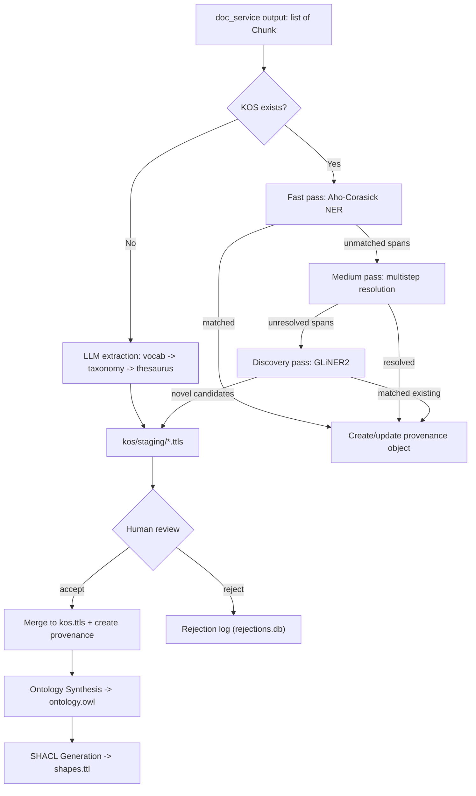

# KOS Extraction Pipeline

This document specifies the design for Spindle's KOS extraction pipeline — everything that happens **after** the document preprocessing pipeline ([doc_service.md](doc_service.md)) produces enriched chunks and **before** KG triple extraction. It covers entity linking, NER, and the staging/review workflow for KOS maintenance.

---

## Provenance Offset Mapping Contract

The document preprocessing pipeline outputs chunks with positional metadata. When a preprocessing annotation (coref, NER, entity link) later becomes evidence for a KOS concept or KG triple, the provenance system needs **document-level** offsets. The doc_service does not compute these; downstream consumers must.

### Contract

- Each chunk carries `chunk.metadata["start_index"]` — the document-level character offset where the chunk begins in the Docling output (character-based, matching doc_service's character tokenizer).
- Each annotation within a chunk carries `span_start` and `span_end` relative to the chunk text.
- **Mapping formula**: `document_offset = chunk.metadata["start_index"] + annotation["span_start"]` (and similarly for `span_end`).

### Helper Function

This is the formal interface between doc_service output and all downstream provenance writes:

```python
def to_document_offset(chunk: Chunk, span_start: int, span_end: int) -> tuple[int, int]:
    """Convert chunk-relative span offsets to document-level offsets.

    Contract: doc_service guarantees chunk.metadata["start_index"] exists.
    """
    base = chunk.metadata["start_index"]
    return (base + span_start, base + span_end)
```

When writing to the SQLite `evidence_spans` table (see [provenance_model.md](provenance_model.md)), consumers must call this function to populate `start_offset` and `end_offset`.

---

## Data Flow Overview



---

## Workflow: No KOS Exists (Cold Start)

1. Run full LLM-based entity extraction across all chunks:
   - **Vocabulary extraction**: identify concepts, labels, definitions, scope notes.
   - **Taxonomy extraction**: infer `skos:broader` / `skos:narrower` hierarchies.
   - **Thesaurus extraction**: infer `skos:related` associations.
2. Write output to staging files (`kos/staging/vocabulary.ttls`, `taxonomy.ttls`, `thesaurus.ttls`) as defined in [kos_data_model.md](kos_data_model.md) section 1. Each concept in staging gets a generated `dct:identifier` (see [kos_data_model.md](kos_data_model.md) §2 for the ID generation strategy) and an RDF-star `spndl:hasProvenance` annotation referencing that identifier.
3. **Provenance at extraction time**: For each LLM-extracted concept, create a `provenance_objects` row (`object_type = 'vocab_entry'`, `object_id = dct:identifier`). Insert `provenance_docs` and `evidence_spans` rows linking the concept back to the chunks the LLM used as input. Evidence span offsets follow the same `to_document_offset()` mapping as incremental extraction. Confidence values are mapped from the LLM's response (see [Confidence Assignment](#confidence-assignment)).
4. Human review before merge into `kos.ttls`.

---

## Coref-Resolved Text Reconstruction

doc_service outputs chunks whose `text` field contains the **original, unmodified** document text. Coreference resolutions are stored as annotations in `chunk.metadata["coref_annotations"]` (see [doc_service.md](doc_service.md) Stage 3). Before running the three-pass NER cascade, this pipeline reconstructs a coref-resolved version of the chunk text by applying the annotations.

### Algorithm

```python
def reconstruct_coref_resolved_text(chunk: Chunk) -> str:
    """Build coref-resolved text by replacing mentions with their antecedents.

    Replacements are applied in reverse offset order so that earlier offsets
    remain valid after each substitution.
    """
    text = chunk.text
    annotations = chunk.metadata.get("coref_annotations", [])
    if not annotations:
        return text

    sorted_anns = sorted(annotations, key=lambda a: a["span_start"], reverse=True)
    for ann in sorted_anns:
        text = text[:ann["span_start"]] + ann["resolved_to"] + text[ann["span_end"]:]
    return text
```

**Important**: The resolved text is used only for NER scanning (passes 1–3 below). It is **never persisted** — the original `chunk.text` remains the source of truth for all provenance offsets. When recording evidence spans in the provenance store, always use offsets relative to the original `chunk.text` and convert to document-level offsets via `to_document_offset()`.

### Offset Mapping After Reconstruction

Because replacements change string length (e.g., replacing "he" with "John Smith"), character positions in the resolved text do not correspond to positions in the original text. When a pass finds a match in the resolved text, the match position must be mapped back to the original text to produce correct provenance offsets.

```python
def build_offset_map(chunk: Chunk) -> list[tuple[int, int, int]]:
    """Build a mapping from resolved-text offsets to original-text offsets.

    Returns a list of (resolved_start, original_start, length_delta) entries
    sorted by resolved_start, enabling binary search for reverse mapping.
    """
    annotations = sorted(
        chunk.metadata.get("coref_annotations", []),
        key=lambda a: a["span_start"],
    )
    offset_map = []
    cumulative_delta = 0
    for ann in annotations:
        original_start = ann["span_start"]
        original_len = ann["span_end"] - ann["span_start"]
        resolved_len = len(ann["resolved_to"])
        resolved_start = original_start + cumulative_delta
        offset_map.append((resolved_start, original_start, resolved_len - original_len))
        cumulative_delta += resolved_len - original_len
    return offset_map
```

Downstream passes use this map to convert a match position in the resolved text back to the corresponding span in the original `chunk.text`.

---

## Workflow: KOS Exists (Incremental Extraction)

For each chunk, reconstruct the coref-resolved text (see above), then run a three-pass cascade. Each pass handles a different class of entity mention, and unresolved spans flow to the next pass.

### Pass 1: Fast Pass — Aho-Corasick NER

Use `POST /kos/search/ahocorasick` ([kos_data_model.md](kos_data_model.md) section 9.1):

- Scan the **coref-resolved** chunk text against the Aho-Corasick automaton, which indexes all `skos:prefLabel`, `skos:altLabel`, and `skos:hiddenLabel` values from the KOS (minus blacklisted terms).
- **If matched**: create/update a provenance object in the SQLite provenance store (see [Provenance Linkage Pattern](#provenance-linkage-pattern)). Record document-level offsets using `to_document_offset()`. Assign confidence `"high"`.
- **Unmatched text spans** flow to pass 2.

### Pass 2: Medium Pass — Multistep Resolution

Use `POST /kos/search/multistep` ([kos_data_model.md](kos_data_model.md) section 9.3):

- For each entity mention in unmatched spans, call the multistep endpoint (exact label lookup, then ANN semantic search).
- **If resolved**: create/update provenance object. Record document-level offsets. Assign confidence based on resolution method (see [Confidence Assignment](#confidence-assignment)).
- **Unresolved mentions** flow to pass 3.

### Pass 3: Discovery Pass — GLiNER2

- Run GLiNER2 on text spans that neither pass 1 nor pass 2 resolved. Seed the label set with `skos:prefLabel` and `skos:altLabel` values from the KOS (via `KOSService.get_label_set()`) to bias recognition toward known concepts. Do not seed with `skos:hiddenLabel` — hidden labels (misspellings, abbreviations) are handled by the Aho-Corasick pass.
- Filter GLiNER2 output against `blacklist.txt` before further processing.
- **If GLiNER2 matches an existing KOS concept**: create/update provenance object. Record document-level offsets. Assign confidence `"medium"`.
- **If GLiNER2 detects a novel entity** (not in the KOS): write the candidate to `kos/staging/vocabulary.ttls` for human review. Novel entities enter as vocabulary-level concepts (`skos:Concept` with `prefLabel`, `definition`, and `dct:identifier`). Taxonomy and thesaurus relationships for accepted novel entities are deferred to the next full pipeline run.

---

## Staging and Review Workflow

When staging files accumulate candidates:

1. **Human review**: user inspects candidates in staging files (via a UI or CLI tool).
2. **If accepted**: merge the candidate into `kos.ttls` (graph union merge as described in [kos_data_model.md](kos_data_model.md) section 10). Create or update provenance objects with the new concept's URI and `dct:identifier`.
3. **If rejected**: log the rejection to the SQLite rejection log (`kos/rejections.db`; see [kos_data_model.md](kos_data_model.md) section 1 for file layout and section 9.11 for the query endpoint). Fields: `rejected_term`, `source_doc_id`, `chunk_index`, `rejection_reason`, `rejected_at`, `rejected_by`. Users can periodically review the logs to identify patterns (e.g., recurring false positives that should be added to the blacklist).

### Merge Validation

The merge is an atomic operation — it either fully succeeds or fully rolls back. No partial merges are permitted.

1. **Validation**: after loading staging files into a temporary Oxigraph store, run SKOS integrity checks (no orphaned concepts, no cycles in `skos:broader`, all `skos:related` are symmetric) as specified in [kos_data_model.md](kos_data_model.md) section 10.
2. **If validation passes**: serialize the merged graph to `kos.ttls` and trigger `POST /kos/reload`.
3. **If validation fails**: abort the merge and return a structured validation report — a list of violation objects, each containing `violation_type`, `subject_uri`, `predicate`, `object_uri`, and `message`. The user corrects the issues (by editing staging files or using the concept CRUD endpoints) and re-attempts the merge.

---

## Ontology Synthesis Stage

After staging files are merged into `kos.ttls`, the pipeline runs ontology synthesis to keep the OWL ontology and SHACL shapes aligned with the updated SKOS thesaurus.

1. **Ontology synthesis**: consumes the consolidated SKOS thesaurus (via `KOSService`) plus the corpus to generate OWL class hierarchy and property axioms. Writes to `ontology.owl`. See [kos_data_model.md](kos_data_model.md) section 3 for the OWL data model and section 10 for the pipeline stage description.
2. **SHACL generation**: optionally auto-generates SHACL shapes from the OWL output and saves them to `shapes.ttl`. These serve as starting-point constraints that can be manually tightened.

### Ontology Provenance

Each generated OWL class or property gets a `provenance_objects` row with `object_type = 'owl_entity'` and an `object_id` matching the `spndl:hasProvenance` value on the OWL entity (e.g., `"ontology-pump"`). The provenance chain traces back to the SKOS concepts that informed the axiom (via `provenance_docs`) and transitively to the original source documents. SHACL shapes inherit provenance transitively through the OWL entity they target and do not get independent provenance objects. This follows the same pattern as `vocab_entry` provenance described below.

---

## Confidence Assignment

Each RDF-star annotation in `kos.ttls` carries a `spndl:confidence` value (`"high"`, `"medium"`, or `"low"`). The table below specifies how confidence is determined based on the resolution method or extraction source.

| Source | Confidence | Rationale |
|--------|-----------|-----------|
| Aho-Corasick exact match (pass 1) | `"high"` | Deterministic dictionary match on a known label |
| Multistep: exact label match (pass 2) | `"high"` | Exact normalized string match against KOS label |
| Multistep: ANN semantic match, score >= 0.9 (pass 2) | `"high"` | Strong semantic similarity to a known concept |
| Multistep: ANN semantic match, score 0.7–0.9 (pass 2) | `"medium"` | Moderate semantic similarity |
| GLiNER2 match to existing concept (pass 3) | `"medium"` | Neural match, less certain than dictionary/vector methods |
| GLiNER2 novel entity (accepted from staging) | `"medium"` | Human-reviewed but originally machine-discovered |
| LLM-extracted taxonomy (`skos:broader`) | LLM output, mapped to `"high"` / `"medium"` / `"low"` | LLM provides confidence in BAML response |
| LLM-extracted thesaurus (`skos:related`) | LLM output, mapped to `"high"` / `"medium"` / `"low"` | LLM provides confidence in BAML response |

---

## Provenance Linkage Pattern

When an entity linking or NER step resolves a mention to a KOS concept:

1. Look up or create a `provenance_objects` row with `object_id = dct:identifier` value and `object_type = 'vocab_entry'`.
2. Insert a `provenance_docs` row linking the provenance object to `doc_id = chunk.source_id` (which equals `DocumentRecord.doc_id` from the doc_service — see [doc_service.md](doc_service.md) Stage 2 Chunk Data Model).
3. Insert an `evidence_spans` row with:
   - `text`: the matched span text from the **original** chunk text (not the coref-resolved version).
   - `start_offset`: computed via `to_document_offset(chunk, span_start, span_end)[0]`. If the match was found in coref-resolved text, use `build_offset_map()` to convert resolved-text offsets back to original-text offsets first.
   - `end_offset`: computed via `to_document_offset(chunk, span_start, span_end)[1]`.
   - `section_path`: copied from `chunk.metadata["section_path"]`. This records the document section hierarchy (e.g., `["Introduction", "Background"]`) where the evidence was found, enabling section-level provenance queries without re-parsing the source document. See [provenance_model.md](provenance_model.md) for the column definition.

This ensures every KOS concept can trace back to the exact text spans that support it, including the structural context of where in the document the evidence appeared.
