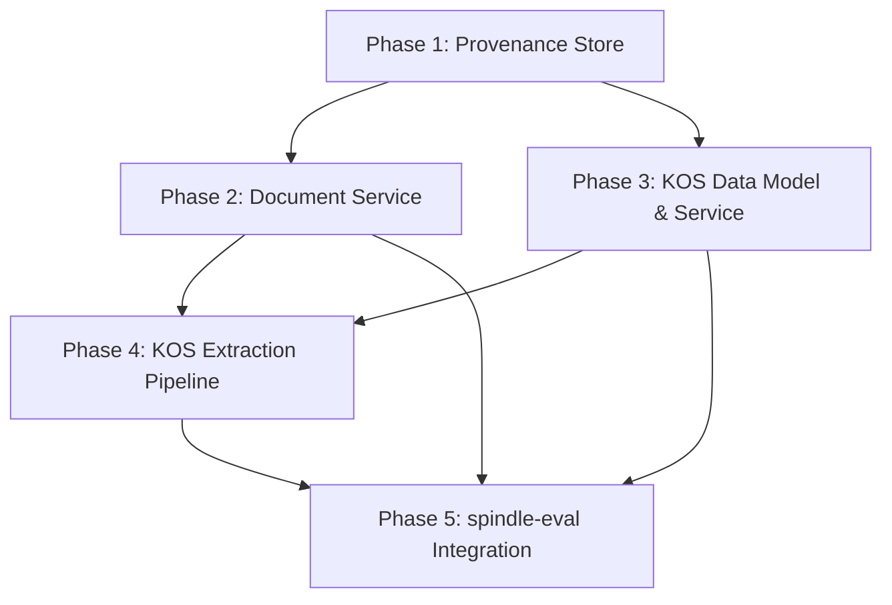

# Spindle v2 Implementation Plan

## Current State

Spindle currently has:

- **Extraction** via BAML/LLM (`SpindleExtractor` in `spindle/extraction/extractor.py`)
- **Graph Store** over Kuzu (`GraphStore` in `spindle/graph_store/store.py`) with provenance stored inline as JSON blobs on edges
- **Entity Resolution** (`EntityResolver` in `spindle/entity_resolution/resolver.py`) using semantic blocking + LLM matching
- **Vector Store** via ChromaDB (`ChromaVectorStore` in `spindle/vector_store/chroma.py`)
- **Ingestion** via LangChain splitters (`LangChainIngestionPipeline` in `spindle/ingestion/pipeline/executor.py`)
- **Pipeline** module with vocabulary/taxonomy/thesaurus/ontology stages (`spindle/pipeline/`)
- **Observability** via `EventRecorder` + `ServiceEvent` (`spindle/observability/`)
- **API** via FastAPI with routers for ingestion, extraction, ontology, resolution, process, corpus (`spindle/api/main.py`)

## What the Design Documents Specify

Five interrelated subsystems, summarized by dependency order:




---

## Phase 1: Provenance Store

**Source**: [provenance_model.md](docs/v2/design/provenance_model.md)

**Goal**: Replace the inline JSON provenance on Kuzu edges with a normalized SQLite side-table that supports both point lookups (edge -> source docs) and reverse lookups (doc changed -> affected edges).

**New files:**

- `spindle/provenance/` package:
  - `__init__.py` -- exports
  - `store.py` -- `ProvenanceStore` class wrapping SQLite with the three-table schema (`provenance_objects`, `provenance_docs`, `evidence_spans`)
  - `models.py` -- Pydantic/dataclass models: `ProvenanceObject`, `ProvenanceDoc`, `EvidenceSpan`

**Schema** (from design doc):

```sql
CREATE TABLE provenance_objects (
    object_id TEXT PRIMARY KEY,
    object_type TEXT NOT NULL  -- 'kg_edge' | 'owl_entity' | 'vocab_entry'
);
CREATE TABLE provenance_docs (
    id INTEGER PRIMARY KEY AUTOINCREMENT,
    provenance_object_id TEXT NOT NULL REFERENCES provenance_objects(object_id) ON DELETE CASCADE,
    doc_id TEXT NOT NULL
);
CREATE TABLE evidence_spans (
    id INTEGER PRIMARY KEY AUTOINCREMENT,
    provenance_doc_id INTEGER NOT NULL REFERENCES provenance_docs(id) ON DELETE CASCADE,
    text TEXT NOT NULL,
    start_offset INTEGER,
    end_offset INTEGER,
    section_path TEXT  -- JSON array
);
```

**Modifications to existing code:**

- [spindle/graph_store/store.py](spindle/graph_store/store.py): Accept optional `ProvenanceStore` in `__init`__. When adding triples, write provenance to SQLite instead of JSON blobs on edges. Keep a `provenance_object_id` field on edges/nodes.
- [spindle/graph_store/backends/kuzu.py](spindle/graph_store/backends/kuzu.py): Remove `supporting_evidence` JSON column from edge schema; add `provenance_object_id TEXT` column instead.

**Key methods on `ProvenanceStore`:**

- `create_provenance(object_id, object_type, docs, spans)` -- batch insert
- `get_provenance(object_id)` -- point lookup (pattern 1)
- `get_affected_objects(doc_id)` -- reverse lookup (pattern 2)
- `delete_provenance(object_id)` -- cascade delete
- `update_provenance_for_doc(doc_id, ...)` -- re-extract scenario

**Tests**: `tests/test_provenance_store.py` covering both access patterns, cascade deletes, batch operations.

---

## Phase 2: Document Service (Preprocessing Pipeline)

**Source**: [doc_service.md](docs/v2/design/doc_service.md)

**Goal**: Replace the LangChain-based ingestion pipeline with a three-stage pipeline: Docling conversion + Chonkie chunking + fastcoref resolution. The output is `list[Chunk]` with positional metadata and coref annotations.

**New files:**

- `spindle/preprocessing/` package:
  - `__init__.py`
  - `preprocessor.py` -- `SpindlePreprocessor` class (orchestrator)
  - `ingestion.py` -- Stage 1: Docling conversion, diff detection, document catalog
  - `chunking.py` -- Stage 2: Chonkie recursive chunking with overlap
  - `coref.py` -- Stage 3: fastcoref per-document resolution, annotation projection onto chunks
  - `models.py` -- `Chunk` dataclass, `DocumentRecord` dataclass
  - `offsets.py` -- `to_document_offset()`, `build_offset_map()`, `reconstruct_coref_resolved_text()`

**Key design decisions from the doc:**

- Chonkie replaces LangChain `RecursiveCharacterTextSplitter`
- `chunk.metadata["start_index"]` is the contract for provenance offset mapping
- Coref runs on full document text, projected onto chunks
- Chunk text is never modified; coref annotations stored in metadata
- Incremental processing via content hash comparison (unchanged docs are skipped)

**Dependencies to add to `pyproject.toml`:**

- `docling` -- document conversion
- `chonkie` -- chunking
- `deepdiff` -- diff detection
- `fastcoref` -- coreference resolution

**Modifications to existing code:**

- [spindle/ingestion/](spindle/ingestion/) -- The existing LangChain pipeline remains for backward compatibility but the new `spindle/preprocessing/` package is the v2 path. Add deprecation notices.
- [spindle/configuration.py](spindle/configuration.py) -- Add preprocessing config fields (`chunk_size`, `overlap`, `strategy`, `coref_model`)

**Tests**: `tests/test_preprocessing.py` covering each stage, incremental processing, coref projection, offset mapping.

---

## Phase 3: KOS Data Model & Service

**Source**: [kos_data_model.md](docs/v2/design/kos_data_model.md)

This is the largest phase. It builds the `KOSService` runtime that loads SKOS/OWL/SHACL files into Oxigraph and exposes derived indices + FastAPI endpoints.

### 3a: KOS File Layout & Data Model

**New files:**

- `kos/` directory at project root (created per-project, not shipped in package):
  - `kos.ttls`, `ontology.owl`, `shapes.ttl`, `blacklist.txt`, `rejections.db`
  - `staging/` -- `vocabulary.ttls`, `taxonomy.ttls`, `thesaurus.ttls`
  - `config/scheme.ttl`

### 3b: KOSService Runtime

**New files:**

- `spindle/kos/` package:
  - `__init__.py`
  - `service.py` -- `KOSService` class: loads Oxigraph store, builds derived indices, exposes query methods
  - `indices.py` -- Derived indices: Aho-Corasick automaton, ANN search index, label-to-URI map, URI-to-concept cache
  - `models.py` -- `ConceptRecord`, `EntityMention`, `ResolutionResult`, `ValidationReport` dataclasses
  - `serializer.py` -- Read/write Turtle-Star files, merge logic (graph union)
  - `blacklist.py` -- Blacklist and rejection log management
  - `validation.py` -- SKOS integrity checks (no orphans, no cycles, symmetric `related`), SHACL validation

**Dependencies to add:**

- `pyoxigraph` -- in-process RDF/SPARQL store
- `pyahocorasick` -- Aho-Corasick automaton for NER
- `hnswlib` -- ANN vector search (preferred over FAISS per design doc)
- `pyshacl` -- SHACL validation

**Key `KOSService` methods:**

- `__init__(kos_dir)` -- load files into Oxigraph, build indices
- `reload()` -- atomic swap: build new store/indices, then replace
- `search_ahocorasick(text, longest_match_only)` -- NER scan
- `search_ann(query, top_k)` -- semantic search
- `resolve_multistep(mentions, threshold)` -- fast + medium pass
- `get_concept(concept_id)` / `list_concepts(...)` / `create_concept(...)` / `update_concept(...)` / `delete_concept(...)`
- `get_provenance(concept_id)` -- delegates to `ProvenanceStore`
- `get_hierarchy(root, depth)` / `get_ancestors(...)` / `get_descendants(...)`
- `get_label_set(include_alt)` -- for GLiNER2 seeding
- `validate_triples(triples)` -- SHACL validation
- `sparql(query)` -- raw SPARQL
- `get_rejections(term, doc_id)` -- rejection log queries

### 3c: KOS FastAPI Endpoints

**New file:**

- `spindle/api/kos_router.py` -- FastAPI router mounted at `/kos` with all endpoints from [kos_data_model.md](docs/v2/design/kos_data_model.md) section 9:


| Method              | Path                            | Description           |
| ------------------- | ------------------------------- | --------------------- |
| POST                | `/kos/search/ahocorasick`       | NER scan              |
| GET                 | `/kos/search/ann`               | Semantic search       |
| POST                | `/kos/search/multistep`         | Multi-step resolution |
| GET/POST/PUT/DELETE | `/kos/concepts[/{id}]`          | Concept CRUD          |
| GET                 | `/kos/concepts/{id}/provenance` | Provenance lookup     |
| GET                 | `/kos/hierarchy/`*              | Taxonomy traversal    |
| GET                 | `/kos/ontology/`*               | OWL queries           |
| POST                | `/kos/validate`                 | SHACL validation      |
| POST                | `/kos/sparql`                   | Ad-hoc SPARQL         |
| POST                | `/kos/reload`                   | Reload KOS            |
| GET                 | `/kos/rejections`               | Rejection log         |


**Modification:**

- [spindle/api/main.py](spindle/api/main.py) -- Mount the new KOS router

**Tests**: `tests/test_kos_service.py` (unit tests for `KOSService` with fixture SKOS/OWL files), `tests/test_kos_api.py` (FastAPI TestClient tests for KOS endpoints).

---

## Phase 4: KOS Extraction Pipeline

**Source**: [kos_extraction.md](docs/v2/design/kos_extraction.md)

**Goal**: Implement the three-pass NER cascade and staging/review workflow that produces and maintains the KOS.

**New files:**

- `spindle/kos/extraction.py` -- `KOSExtractionPipeline` class:
  - Cold start path (LLM-based vocab -> taxonomy -> thesaurus extraction)
  - Incremental path (three-pass cascade)
- `spindle/kos/ner.py` -- NER pass implementations:
  - `fast_pass(chunks, kos_service)` -- Aho-Corasick
  - `medium_pass(unmatched, kos_service)` -- multistep resolution
  - `discovery_pass(unmatched, kos_service)` -- GLiNER2
- `spindle/kos/staging.py` -- Staging/review workflow:
  - `write_staging(candidates, stage_dir)`
  - `merge_staging(stage_dir, kos_service)` -- atomic merge with validation
  - `reject_candidate(term, doc_id, reason, rejected_by)`
- `spindle/kos/synthesis.py` -- Ontology synthesis:
  - `synthesize_ontology(kos_service, corpus)` -- SKOS -> OWL
  - `generate_shacl(ontology_path)` -- OWL -> SHACL

**Modification to existing pipeline module:**

- [spindle/pipeline/](spindle/pipeline/) -- The existing `vocabulary.py`, `taxonomy.py`, `thesaurus.py`, `ontology_stage.py` stages contain BAML prompt logic that should be reused. Refactor these to be callable from `KOSExtractionPipeline` while keeping the existing `PipelineOrchestrator` working for backward compatibility.

**Dependencies to add:**

- `gliner` -- GLiNER2 model for discovery NER pass

**Provenance integration:**

- Every resolved mention writes to `ProvenanceStore` via the linkage pattern in `kos_extraction.md`
- Offset mapping uses `to_document_offset()` from `spindle/preprocessing/offsets.py`
- Confidence assignment follows the table in the design doc

**Tests**: `tests/test_kos_extraction.py` covering cold start, three-pass cascade, staging merge, provenance writes, confidence assignment.

---

## Phase 5: spindle-eval Integration

**Source**: [plan-spindle-modifications.md](docs/v2/design/plan-spindle-modifications.md)

This phase creates the bridge between spindle and spindle-eval's Stage-based pipeline executor.

### 5a: Tracker Protocol (Phase 2 from design doc)

**New file:**

- `spindle/tracking.py` -- `NoOpTracker` class that satisfies spindle-eval's `Tracker` protocol, routing events to Python logging

**Modifications:**

- [spindle/extraction/extractor.py](spindle/extraction/extractor.py) -- Accept `tracker` param, emit structured events (existing `_record_extractor_event` can delegate to tracker)
- [spindle/entity_resolution/resolver.py](spindle/entity_resolution/resolver.py) -- Accept `tracker`, emit events
- [spindle/graph_store/store.py](spindle/graph_store/store.py) -- Accept `tracker`, emit events
- [spindle/ingestion/pipeline/executor.py](spindle/ingestion/pipeline/executor.py) -- Accept `tracker`, emit events

### 5b: Hydra Config (Phase 4 from design doc)

**New files:**

- `spindle/hydra_plugin.py` -- `SpindleSearchPathPlugin`
- `spindle/conf/` directory with YAML config groups:
  - `preprocessing/spindle_default.yaml`, `spindle_fast.yaml`
  - `kos_extraction/cold_start.yaml`, `incremental.yaml`
  - `ontology_synthesis/default.yaml`
  - `retrieval/local.yaml`, `global.yaml`, `hybrid.yaml`

**Modification:**

- `pyproject.toml` -- Add Hydra entry point, `eval` optional dependency group

### 5c: Stage Implementations (Phase 5 from design doc)

**New files:**

- `spindle/stages/` package with Stage implementations:
  - `preprocessing.py` -- wraps `SpindlePreprocessor`
  - `kos_extraction.py` -- wraps `KOSExtractionPipeline`
  - `ontology_synthesis.py` -- wraps ontology synthesis
  - `retrieval.py` -- wraps graph + vector store retrieval
  - `generation.py` -- wraps LLM generation
- `spindle/eval_bridge.py` -- `get_pipeline_definition()` factory

**Modification:**

- [spindle/**init**.py](spindle/__init__.py) -- Conditionally export `get_pipeline_definition`

---

## Implementation Order & Dependencies

The phases have clear dependencies:


| Phase                     | Depends On                      | Estimated Complexity                                          |
| ------------------------- | ------------------------------- | ------------------------------------------------------------- |
| Phase 1: Provenance Store | Nothing                         | Medium -- new module, schema migration                        |
| Phase 2: Doc Service      | Nothing (parallel with Phase 1) | Medium -- new pipeline, new dependencies                      |
| Phase 3a-b: KOS Service   | Phase 1 (provenance)            | Large -- Oxigraph integration, 4 derived indices, merge logic |
| Phase 3c: KOS API         | Phase 3b                        | Medium -- 12 endpoint groups                                  |
| Phase 4: KOS Extraction   | Phases 1, 2, 3b                 | Large -- three-pass cascade, staging workflow, GLiNER2        |
| Phase 5a: Tracker         | Nothing (parallel)              | Small -- one file + 4 modifications                           |
| Phase 5b: Hydra Config    | Nothing (parallel)              | Small -- config files + plugin                                |
| Phase 5c: Stage Impls     | Phases 2, 3, 4, 5a              | Medium -- wiring stages to existing code                      |


**Recommended execution order:**

1. **Phases 1 + 2 + 5a + 5b** in parallel (no interdependencies)
2. **Phase 3** (depends on Phase 1)
3. **Phase 4** (depends on Phases 1, 2, 3)
4. **Phase 5c** (depends on everything above)

---

## New Dependencies Summary


| Package         | Purpose                                | Dependency Type         |
| --------------- | -------------------------------------- | ----------------------- |
| `pyoxigraph`    | In-process RDF/SPARQL                  | Core                    |
| `pyahocorasick` | Aho-Corasick NER automaton             | Core                    |
| `hnswlib`       | ANN vector search for KOS              | Core                    |
| `pyshacl`       | SHACL validation                       | Core                    |
| `docling`       | Document conversion                    | Core                    |
| `chonkie`       | Semantic chunking                      | Core                    |
| `deepdiff`      | Diff detection                         | Core                    |
| `fastcoref`     | Coreference resolution                 | Core                    |
| `gliner`        | GLiNER2 discovery NER                  | Core                    |
| `hydra-core`    | Config composition (spindle-eval only) | Optional (`eval` extra) |
| `spindle-eval`  | Evaluation framework                   | Optional (`eval` extra) |


---

## Migration & Backward Compatibility

- The existing `spindle/ingestion/` pipeline and `spindle/pipeline/` orchestrator remain functional. The new `spindle/preprocessing/` and `spindle/kos/` packages are the v2 path.
- The existing `EventRecorder` pattern in `spindle/observability/` continues to work alongside the new `Tracker` protocol. The tracker is additive.
- The `GraphStore` provenance migration (JSON blobs -> SQLite) should include a one-time migration utility to convert existing provenance data.
- All new FastAPI endpoints are mounted under `/kos` and do not conflict with existing routes.

